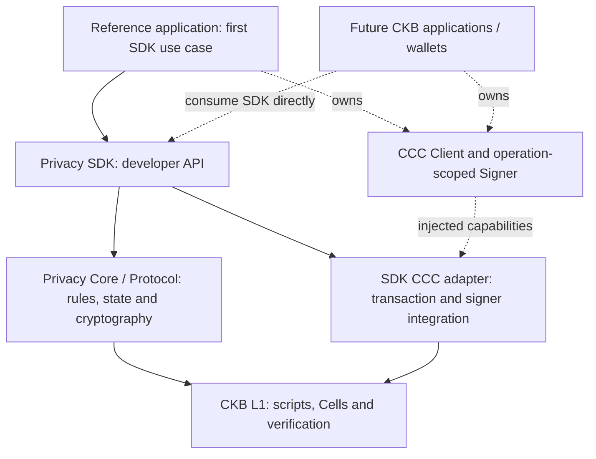
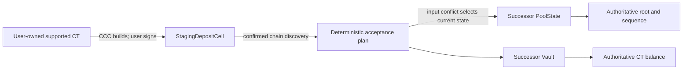
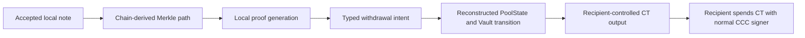
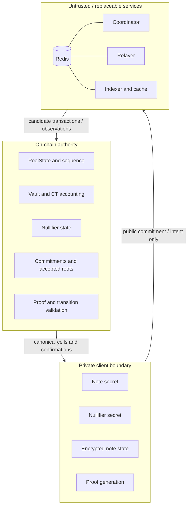
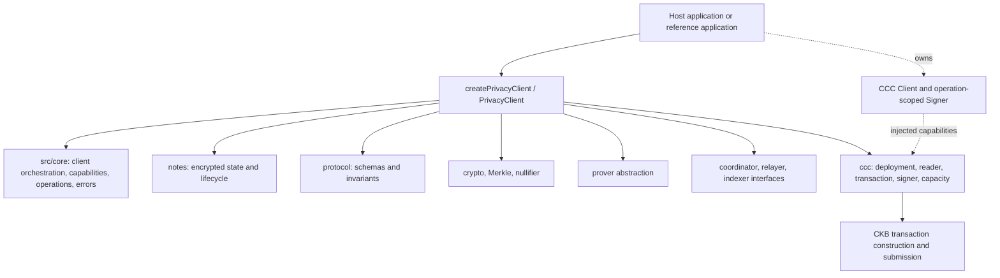

> Historical snapshot of `docs/architecture.md`, superseded by the incognito direction on 2026-09-29. This record describes earlier work, not current deliverables, deployment status, or privacy guarantees. See [current documentation](../../README.md).

# Obscell Privacy Protocol Architecture

**Status:** Target corrected-V1 architecture. The diagrams below specify the grant destination and trust boundaries; they do not depict a deployed system. Today, PoolState initialization/acceptance/withdrawal fail closed, non-fixture Pudge scanner/storage/transaction adapters are absent, and no corrected-V1 Pudge flow has run. See [implementation status](status.md) for the evidence-backed boundary.

## Component Roles

Obscell Privacy Protocol, described as **CKB Privacy Core and SDK**, is one infrastructure project with five distinct architectural responsibilities:

| Component | Role |
|---|---|
| Privacy Core / Protocol | Protocol defines valid private operations; Core implements those rules through cryptography, commitments, notes, Merkle/nullifier state, verification, and CKB scripts |
| Privacy SDK | Exposes that infrastructure through a framework-agnostic developer API; applications do not reproduce low-level privacy logic |
| CCC | Host-owned CKB client and operation-scoped signer, injected through the SDK's CCC adapter for chain reads, transaction construction, signing, and submission |
| Reference application | Demonstrates SDK integration through the initial one-asset, fixed-denomination privacy-pool use case |
| CKB | Executes scripts, validates Cell state transitions, and settles accepted transactions |

`Privacy Core / Protocol` names one infrastructure layer: protocol security rules together with the cryptographic, state, and CKB implementation that enforces them. It spans the SDK's protocol, crypto, Merkle, nullifier, notes, prover, and validation groups plus the circuit and relevant contracts. It is not a public class or a separate package, and it must not be confused with the literal `mixer-sdk/src/core/` orchestration directory.

The fixed-denomination privacy pool is the first controlled use case through which the protocol is validated. It provides a concrete environment for testing commitments, Merkle state, nullifiers, proof authorization, CT conservation, and CKB state transitions. The pool itself is not the architectural boundary of the project.

## System

The primary relationship is **Application -> Privacy SDK -> Privacy Core / CKB scripts**, with CCC as an application-owned dependency injected through the adapter. Core does not delegate privacy validity to CCC. The reference application is not a separate product being funded alongside the SDK. It is the first controlled consumer of the Privacy SDK and provides a practical demonstration of the protocol's capabilities. Future applications can consume the same SDK directly. Coordinator, relayer, and indexer services are replaceable operators described in the trust boundary below; they do not define accepted roots, nullifiers, commitments, or balances.

## Design Rationale

Privacy logic belongs in a reusable core so applications can share one versioned security model, encoding contract, and verification implementation. CKB's Cell model represents explicit ownership and state transitions: lock scripts control spending, while type scripts enforce the privacy state rules. Cryptographic validity, CT conservation, nullifier updates, and recipient binding must be checked as one accepted transaction. A frontend or coordinator assertion cannot substitute for those checks.

The SDK packages this machinery into developer-facing operations and state inspection. Application developers retain CCC for wallet approval and CKB transaction handling, and supply the relevant client and signer at that boundary. The reference application tests whether those interfaces can support a complete practical lifecycle. The one-asset, fixed-denomination V1 scope limits the number of transitions that must be implemented and reviewed; it does not promise private transfers or additional products.

## Deployment And Release

The five-month / approximately 20-week plan proceeds from implementation through real Pudge testnet validation to a validated mainnet-ready release and gated mainnet deployment. The fifth month provides the required hardening and release window for issues discovered during real testnet integration, independent review, and deployment preparation. Its work includes integration defects, cryptographic findings, testnet issues, remediation, and final release evidence. Mainnet requires passing protocol, cryptographic, adversarial, state-transition, SDK, and testnet checks, completed independent review, no unresolved critical or high security findings, reproducible artifacts, and a successful mainnet preflight. If mainnet gates remain unmet, deliver the validated testnet release and documented remediation state instead; any unresolved testnet acceptance remains explicitly incomplete. The [deployment guide](deployment.md) defines the gates; none is evidence of deployment having occurred.

Protocol scripts deploy to CKB, the SDK is published as open-source developer infrastructure, and the reference interface may use a third-party web host. Hosting provides interface delivery only and has no protocol or consensus authority. A malicious frontend can still steal client secrets or mislead a signer, so client-origin integrity remains a client-side risk even when CKB rejects invalid protocol transactions.

## Deposit

The implemented staging foundation commits to pool identity, asset, denomination, leaf, refund lock, and timeout. In the completed design, acceptance will consume the live PoolState/Vault pair and confirmed staging cells atomically. A coordinator may build the transaction, but CKB validation must decide whether it is accepted.

## Withdrawal

The corrected circuit foundation binds pool, asset, denomination/value, supplied root, nullifier, recipient, action, and authorization tag. The unfinished Pool script must recompute protected fields from actual transaction and canonical state data before it may accept the transition.

## Trust Boundary

Under the target trust model, client secrets never belong in coordinator, relayer, indexer, Redis, logs, telemetry, or transaction witnesses. Wiping Redis may lose queues or cached progress, but must not change protocol truth. The clean rebuild and reorganization behavior shown here remains a grant acceptance test.

## SDK

The [rendered SDK integration boundary](../../diagrams/sdk-integration.png) used in the proposal is **target architecture — not deployment evidence**. It shows host ownership of the CCC Client, wallet, and operation-scoped Signer, with their capabilities supplied to the SDK adapter separately from Privacy Core.

The source groups in this diagram are internal responsibilities re-exported through `mixer-sdk`; they are not supported package subpaths. The SDK boundary does not own React, JoyID, wallet selection, deployment keys, relayer hot keys, Redis, analytics, or product UI. Wallet connectors remain application concerns. A signer is supplied only to the operation that needs user approval. The current SDK exposes this boundary and fails unavailable settlement operations explicitly; the live adapters in the diagram remain grant work.

## State Ownership

| Data | Authority | Cached/derived copies |
|---|---|---|
| Pool identity and configuration | Pool Type-ID / genesis PoolState | Deployment manifest, SDK cache |
| Current sequence and root | Live PoolStateCell | Client and indexer cache |
| Commitments | Accepted PoolState transition / chain history | Merkle index |
| Vault value and CT asset | Live VaultCell plus CT script | Client and service cache |
| Nullifier spent state | Live PoolState nullifier commitment | Indexer cache |
| Note secrets | User-controlled encrypted state | No service copy |
| Operation queue and idempotency | Operational only | Redis or local store |
| Transaction confirmation | CKB canonical chain | Service/client observations |

## Identity And Versioning

A corrected-V1 deployment will use fresh script code hashes, Type-IDs, pool IDs, circuit artifact hashes, and a versioned deployment manifest. None exists today. Legacy registry cells and coordinator sessions must never be V1 genesis inputs. Network, genesis hash, code hashes, outpoints, script args, circuit hashes, tree depth, denomination, and CT identity must all match before `getCapabilities()` may report settlement as available.
