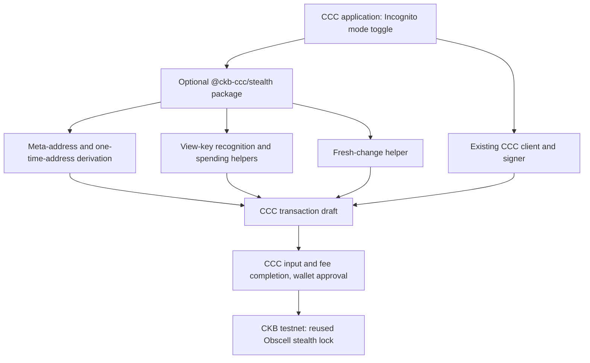

# CCC Incognito Architecture

**Target integration, not deployment evidence.** The current local application demonstrates this flow with visibly simulated records and unsigned transaction drafts.

## One optional CCC capability

An application already using CCC opts into the working package `@ckb-ccc/stealth`. The package adds meta-address handling, one-time-address derivation, recognition of incoming records, spend-key derivation, and fresh-change preparation. CCC retains transaction primitives, client/indexer access, wallet approval, and signing.

The contribution target is a scoped package inside CCC. This repository provides a private local candidate and demo; neither publication nor upstream acceptance is claimed.

The active workspace has two members: `packages/stealth` contains the reusable modules, while `examples/incognito` contains the application, its state and views, and browser evidence tooling. The application imports the public package entry points. Public demo identities and deterministic test helpers are isolated in `@ckb-ccc/stealth/testing`. Earlier implementations are retained in [Git history](history.md), outside the current review tree and builds.

## CCC UI proof of concept

The example's `src/ccc` boundary adapts the shell and controls of CCC's `packages/demo` at the core 1.12.5 release. [Source provenance](../examples/incognito/CCC_UPSTREAM.md) identifies the exact baseline and substitutions. The existing Vite runtime is retained; no second wallet, router or cryptographic abstraction is introduced.

`App.tsx` applies one Incognito state to sending, the receiving identity and Receive. Normal mode shows the reusable CKB address. Incognito mode shows the public meta-address and fixture-recognition flow. Switching modes invalidates send drafts and cancels pending scans; disconnecting the simulated account resets both flows. Viewing profiles are selected from public fixtures, with no private-key entry. The comparison panel changes neither the account nor its transaction state.

The local CCC controls construct unsigned previews. The upstream wallet provider, live balances, input/fee completion and broadcast handlers are deliberately outside this visual integration. The [demo guide](ccc-ui-demo.md) separates the real local computations from simulated account and chain behavior.

## Send

The recipient publishes a meta-address containing a view public key and a spend public key. The sender uses a fresh ephemeral key to derive a one-time destination and the ephemeral public key needed for recognition. Public announcements and lock arguments must match the reused lock's exact byte layout.

The draft is constructed with CCC. A completed live integration will resolve input capacity, call CCC's input and fee completion routines, present the actual transaction for wallet approval, then sign and submit. In the current demo that handoff is labeled **SIMULATED**: no signed transaction or settlement is produced.

With incognito off, the UI demonstrates an ordinary CCC send. Both modes retain the same application-owned wallet boundary.

## Scan and spend

The receiver uses a view key to test candidate records and identify matching one-time outputs. Scanning does not require the spending secret. Spending additionally requires the spending secret and a transaction signature acceptable to the exact on-chain lock.

Today the package scans supplied local records and prepares a spend plan containing verified local authority and fresh destination/change addresses. It does not invent a live outpoint or construct a spending transaction. Live CCC indexer discovery, canonical-chain confirmation, spent-cell refresh, and the deployed lock's witness/signing integration are not demonstrated.

## Change hygiene

Fresh change goes to a newly derived address rather than a reusable receiving identity. A real implementation must preserve that output through input/fee completion and verify the final transaction. The current UI can demonstrate distinct derived change addresses, but it does not establish anonymity: change amounts, sender inputs, and the transaction graph remain visible.

## What observers see

A one-time destination obscures the link to the recipient's published meta-address. The destination script and ephemeral public key are public. Amounts, input cells, output cells, fees, and transaction timing remain public. Network and amount correlation can still link activity.

No new on-chain protocol is introduced. The [research record](research.md) credits the Obscell contract and wallet implementations and identifies compatibility checks still needed.
