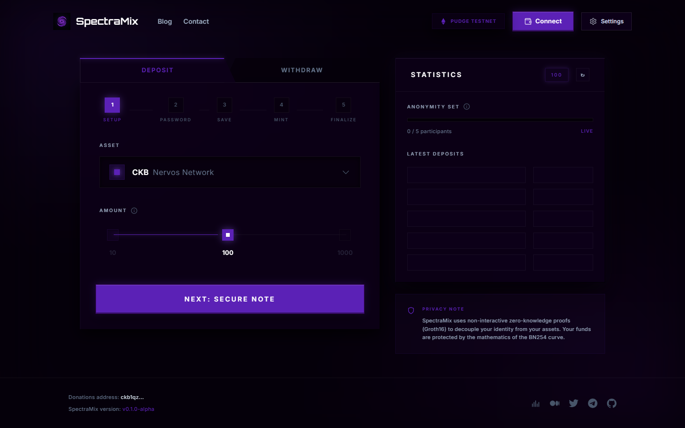
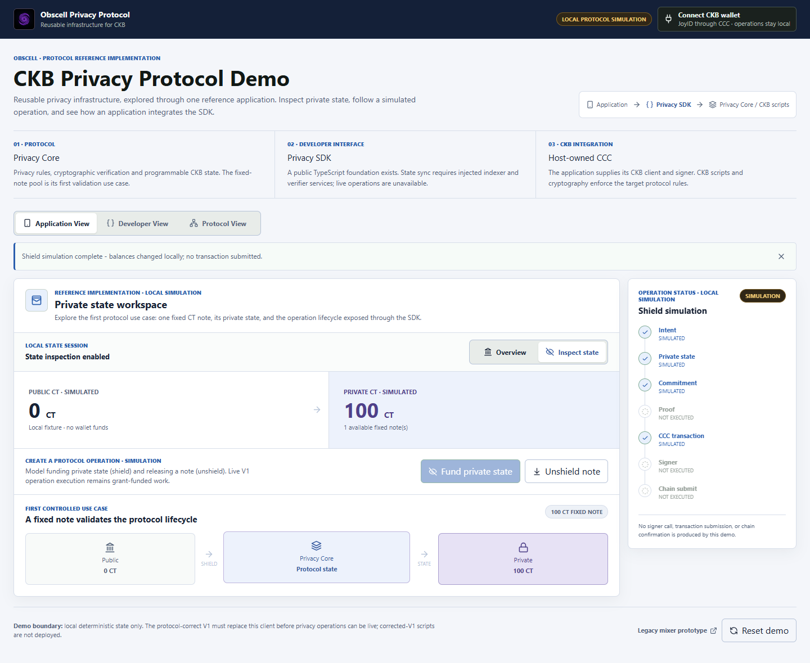
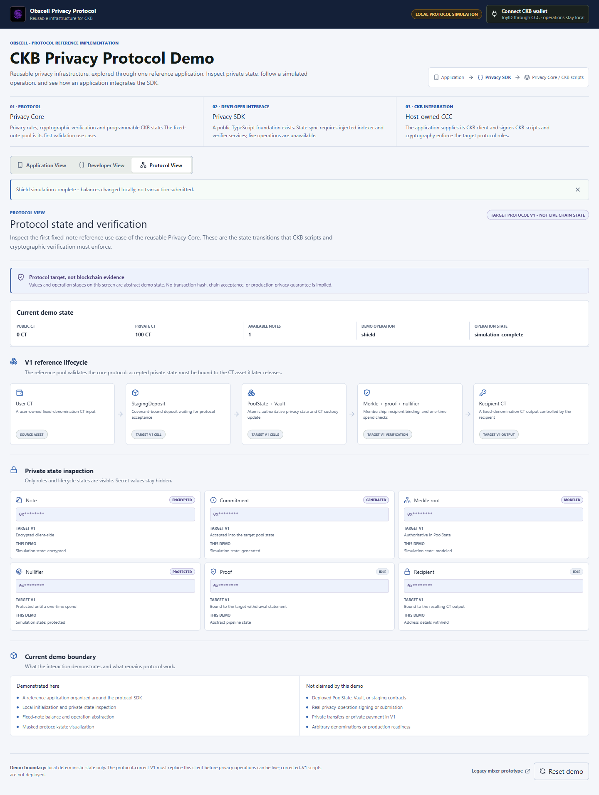
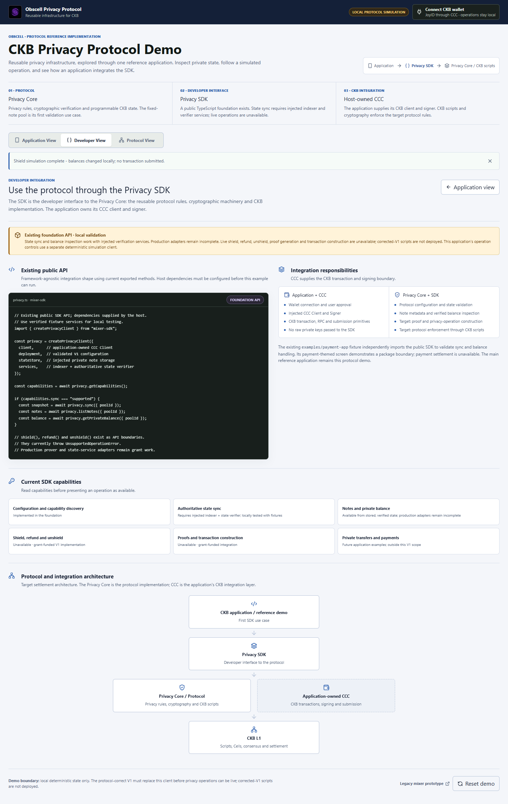

# Privacy protocol proposal evidence

This catalog separates authored architecture diagrams from genuine interface captures. The two diagrams describe target responsibilities. The five proposal screenshots show the actual running interfaces; they do not establish CKB transactions, proof correctness, deployment, privacy guarantees or an independent security review.

The current reference application visibly identifies its privacy behavior as local simulation. Its fixed-denomination lifecycle is the first controlled SDK use case. The host retains its CCC Client, wallet and operation-scoped Signer. No new product or operation was added to obtain these screenshots.

## Paths and figure register

Assets live under `docs/diagrams/` and `docs/evidence/`. The proposal in `docs/` uses `diagrams/...` and `evidence/...`; the root-level proposal uses `docs/diagrams/...` and `docs/evidence/...`. Both resolve to the same files. Funding proposal files remain local and ignored.

| Figure | File | Classification and what it shows |
|---|---|---|
| Unnumbered overview | [system-architecture.png](../diagrams/system-architecture.png) | TARGET ARCHITECTURE: reference application consumes the SDK; the host injects CCC; the SDK exposes Core/Protocol rules; CKB scripts settle on L1 |
| 1 | [previous-hosted-reference.png](previous-hosted-reference.png) | HISTORICAL HOSTED UI: actual SpectraMix interface at the supplied public URL; its Pudge badge, statistics and privacy claims are unverified interface text |
| 2 | [figure-2-ccc-demo.png](figure-2-ccc-demo.png) | SIMULATION: current overview, wallet integration control, private-state workspace and operation boundaries |
| 3 | [figure-3-private-balance.png](figure-3-private-balance.png) | SIMULATION: actual local funding interaction produces 100 CT of fixture private state; no settled funds |
| 4 | [figure-4-developer-protocol.png](figure-4-developer-protocol.png) | SIMULATION / TARGET RULES: commitments, Merkle state, proof, nullifier, recipient and target CKB transitions |
| 5 | [obscell-demo-verified-developer.png](obscell-demo-verified-developer.png) | INTERFACE GUIDANCE: real developer view, SDK interfaces, injected dependencies and explicit unavailable capabilities |
| 6 | [sdk-integration.png](../diagrams/sdk-integration.png) | TARGET ARCHITECTURE: Client injection at initialization, Signer injection per operation and privacy operations/verified state returned across the SDK boundary |

Figures 1–5 are browser captures. Figure 6 is authored SVG artwork, not a screenshot. The sequence has no gap. The historical filename `figure-6-second-consumer.png` below is a separate, unnumbered SDK fixture.

## Capture provenance and PNG hashes

Fresh captures ran on **2026-09-17**, using Playwright **1.55.1**, Chrome **152.0.7977.83**, Node **v25.8.1**, Vite **6.4.3**, device scale factor **1** and a consistent **1440×900** viewport. Full-page screenshots preserve content below the viewport, so PNG heights vary.

- **Local dev:** `http://127.0.0.1:5173/`, served by Vite directly from the current working tree. The capture script starts and closes its own server. This URL is capture provenance, not a permanent hosted service.
- **Hosted V1:** [the previous public SpectraMix interface](https://ckb-privacy-mixer-v1-frontend.vercel.app/), HTTP **200**. It was reachable, so no local legacy fallback was used.
- **Source checkout:** `ee603f7fc7f57a6656246244b96b106e3feea800`, working tree **dirty**. This is a base revision, not a clean release attestation. [The capture manifest](proposal-capture-manifest.json) fingerprints the frontend source, configuration and tooling; uncommitted UI changes are not identified by the base commit alone. The hosted application's deployed source revision is unknown.

The screenshots are unedited output from the browser. Actual UI controls initialize local state and run the shield simulation; there are no mocked pages, invented values, pixel edits, connected wallets or transaction submissions. The capture checks found **zero privacy-operation fetch/XHR requests**, **zero local page runtime errors**, visible simulation/capability disclosures, no horizontal overflow and no displayed transaction hashes or fabricated chain confirmations. The historical page retains its own styling and labels without treating those labels as verified network facts.

| PNG | Captured at (UTC) | Source | Viewport → PNG pixels | SHA-256 |
|---|---|---|---|---|
| [previous-hosted-reference.png](previous-hosted-reference.png) | 2026-09-17 13:09:10.784 UTC | Hosted V1 | 1440×900 → 1440×900 | `5b44c0feeee6b4a3c5b20068c66d13305d8bdd602a81bf930aec0997adf692ac` |
| [figure-2-ccc-demo.png](figure-2-ccc-demo.png) | 2026-09-17 13:08:58.597 UTC | Local dev | 1440×900 → 1440×1179 | `4d69c120ff7e76be32182d96fdc6f0cd90a3bc8a41bb01d67ddd1fe9efda0e0b` |
| [figure-3-private-balance.png](figure-3-private-balance.png) | 2026-09-17 13:09:00.575 UTC | Local dev | 1440×900 → 1440×1179 | `aaa18a42829eeeb1c4c180cea038ca6318ea72ebdd5cc6dee8553472a97827b9` |
| [figure-4-developer-protocol.png](figure-4-developer-protocol.png) | 2026-09-17 13:09:01.212 UTC | Local dev | 1440×900 → 1440×1912 | `0b1611ac3168d5a5b12fd1d74aa6547b32b58d8527ffacf817e2b58323c92ce2` |
| [obscell-demo-verified-developer.png](obscell-demo-verified-developer.png) | 2026-09-17 13:09:01.832 UTC | Local dev | 1440×900 → 1440×2277 | `2859a30e145b02f928f85773123902191a3cc7237bd1b92d7e9d90ff44bf3c4c` |

The [capture manifest](proposal-capture-manifest.json) contains per-file timestamps, source URLs, viewport/dimensions, byte counts, hashes, source fingerprints and integrity results. [Historical-source metadata](previous-hosted-reference.json) records the actual Figure 1 source and response. [The combined local-image manifest](manifest.json) preserves the separate capture dates of untouched supplementary images; its update time is not their capture date.

## Authored diagram provenance

The diagrams use editable SVG sources, white backgrounds, legible sans-serif labels and a consistent blue palette. Both visibly state **Target architecture — not deployment evidence**. The renderer blocks external resources and checks label bounds, page overflow and exact 1600px export width.

| PNG | Generated at (UTC) | Source | Canvas / PNG pixels | SHA-256 |
|---|---|---|---|---|
| [system-architecture.png](../diagrams/system-architecture.png) | 2026-09-17 12:54:48.533 UTC | [system-architecture.svg](../diagrams/system-architecture.svg); authored SVG | 1600×1180 | `dbc08c41c8340820d28c70d96f0abcc1e3376880cefcb1f69540e8511d549d72` |
| [sdk-integration.png](../diagrams/sdk-integration.png) | 2026-09-17 12:54:48.533 UTC | [sdk-integration.svg](../diagrams/sdk-integration.svg); authored SVG | 1600×1100 | `9271e4f83ad62cc6946013bf5c10f144ce05a74930c7a1de03e275dd5bc4d57e` |

The [diagram manifest](../diagrams/manifest.json) also records SVG SHA-256 values, Playwright/browser versions and rendering settings. The [diagram index](../diagrams/README.md) explains responsibilities and the CCC dependency direction. The SDK does not own React, wallet connectors or raw private keys.

## View the five captures



*Figure 1 — Real historical hosted interface. Its Pudge badge, balances/statistics and privacy claims remain unverified UI text. No wallet connection or transaction was performed.*


*Figure 2 — Actual current reference overview with local simulation and wallet/operation boundaries visible.*



*Figure 3 — Local fixture state after the app's simulated funding operation. The 100 CT balance is not a testnet result.*



*Figure 4 — Current protocol view shows target state and verification relationships; values and operation stages are simulated.*



*Figure 5 — Current SDK integration guidance and capability limitations. Live shield, refund, unshield, proof generation and transaction construction remain unavailable.*

## Reproduce

With workspace dependencies installed, run from the repository root:

```sh
pnpm --filter mixer-sdk build
node frontend/scripts/export-architecture-diagrams.mjs
node frontend/scripts/capture-proposal-evidence.mjs
```

The [capture script](../../frontend/scripts/capture-proposal-evidence.mjs) starts the actual Vite dev server with the frontend working directory, launches headless Chrome (or bundled Chromium/Edge), visits the four local views and loads the historical public URL. If that URL is unreachable, it captures the preserved `?view=legacy` route and explicitly records the fallback; the catalog/caption must then identify the local source. Non-GET/HEAD requests are blocked; the script never connects a wallet or requests a signature.

All five captures and integrity assertions must succeed before existing evidence is replaced. Previous PNG/JSON files are archived with their original metadata first. The script updates the capture and image manifests; after a new run, refresh this catalog's date/source/hash rows from those manifests. Browser/font revisions, animation timing and future source changes can affect PNG hashes; the manifests identify each actual run. Reproducing these exact UI pixels requires the captured working-tree source fingerprints, not only its base Git commit.

The [diagram renderer](../../frontend/scripts/export-architecture-diagrams.mjs) exports the checked-in SVG sources. Both scripts accept `PLAYWRIGHT_CHANNEL`. If no browser is available, install Chrome/Edge or run `pnpm --filter frontend exec playwright install chromium`.

## Preserved supplementary captures

These images were **not recaptured** for the September 17 proposal. They retain their original hashes and dates. The legacy viewport comes from its archived manifest; fixture/presentation viewports are also specified by their capture scripts. Original dynamic local ports were not recorded.

| PNG and what it shows | Captured at (UTC) | Source | Viewport → PNG pixels | SHA-256 |
|---|---|---|---|---|
| [figure-1-legacy-mixer.png](figure-1-legacy-mixer.png) — Earlier local SpectraMix interface | 2026-09-04 17:17:51.046 UTC | Historical local preview; port unrecorded | 1280×720 → 1280×930 | `395ec0505fdf1992493857abfc8345ed124bf077fb30792148d060efac427c45` |
| [figure-6-second-consumer.png](figure-6-second-consumer.png) — Applicant-authored SDK package fixture; not Figure 6 | 2026-09-04 17:08:49.192 UTC | Historical local preview; port unrecorded | 1440×900 → 1440×900 | `21979bc8c682eb0632cafc224caee06056123c41df8d9d22044862f2bb421009` |
| [obscell-demo-verified-desktop.png](obscell-demo-verified-desktop.png) — Earlier reset overview | 2026-09-10 00:28:08.644 UTC | Historical local preview; port unrecorded | 1440×900 → 1440×1179 | `e7f9fee1c89ecd4cea4ea2ef15db1590582de1c26c754f17b788e9fae7c1654e` |
| [obscell-demo-verified-mobile.png](obscell-demo-verified-mobile.png) — Earlier mobile simulation layout | 2026-09-10 00:28:08.644 UTC | Historical local preview; port unrecorded | 390×844 → 390×2520 | `9acc75274b8f86c2f35b9e1937f3788feabcab926a9608994a383ca9641461b7` |
| [obscell-demo-verified-presentation.png](obscell-demo-verified-presentation.png) — Earlier 1280px presentation layout | 2026-09-10 00:28:08.644 UTC | Historical local preview; port unrecorded | 1280×720 → 1280×1179 | `49aa900fa6f94f774891bd863613c607724cb22419eb57fcf061415fdad80b9b` |
| [obscell-demo-verified-protocol.png](obscell-demo-verified-protocol.png) — Earlier protocol simulation view | 2026-09-10 00:28:08.644 UTC | Historical local preview; port unrecorded | 1440×900 → 1440×1912 | `b2f07783de620146ef155780e30989f602d223253b9cbaad26e5f67c99986531` |

The applicant-authored [package fixture metadata](figure-6-second-consumer.json) records deterministic local behavior, zero data requests and zero transaction submissions. It demonstrates a package boundary, not external adoption or a supported live payment product.

## Archives and limits

The [pre-refresh snapshot](history/2026-09-17T13-09-10-990Z/) preserves the 14 previous PNG/JSON files byte-for-byte, with an [archive integrity index](history/2026-09-17T13-09-10-990Z/archive-index.json). Its folder date is the archive time, not a capture date. The earlier [September 4 archive](history/2026-09-04/) remains intact with its original raw manifest and filenames.

Manifests and hashes provide reproducibility and drift detection; they are local records, not independent attestations. No corrected-V1 testnet lifecycle, mainnet deployment or independent security review is established by these images. Real chain evidence must be collected through the [Pudge runbook](../pudge-runbook.md), including decoded state/asset changes, recipient subsequent spend, block context and confirmations. This catalog documents artifacts and does not revise the funding or release scope of either proposal copy.
